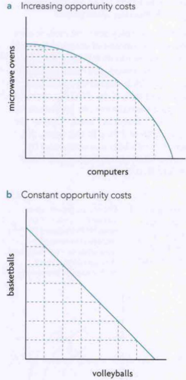
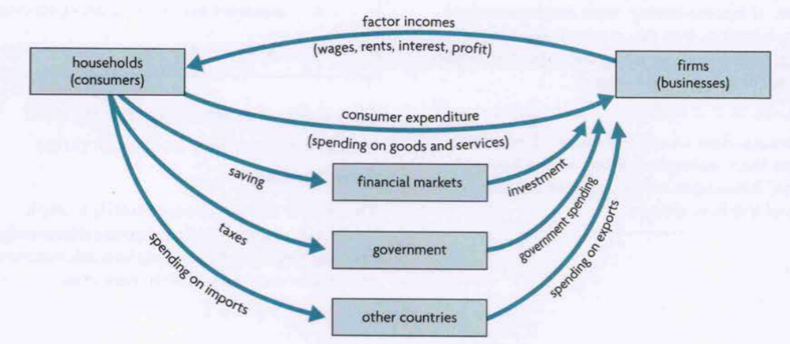

Unit 1: Introduction to Economics
=========
# 1.1: What Is Economics?

## Factors of Production
- Land
  - All Natural Resources (Agricultural and Non-agricultural)
  - Includes everything with respect to land
  - eg: Oil, Water, Forests, Lakes, etc.
- Labour
  - Physical and mental effort that people contribute to production
  - eg: Efforts of Teachers, Consultants, Construction Workers, etc.
- Capital
  - Physical Capital
    - It is a man-made factor of production that itself is used to produce
    - eg: Tools, Machinery, Factories, Infrastructure, etc.
  - Human Capital
    - Closely linked to labour
    - eg: Skills, Knowledge, Health of workers
  - Natural Capital
    - More expanded definition of FOP "Land"
    - Has non-land related natural resources like air and climate
  - Financial Capital
    - Investments, Stocks, Bonds, and Money/Funds
- Entrepreneurship
  - Special human skill to develop new ways to do things, take business risks, and seek new opportunities
  - Entrepreneurs organise the other 3 factors of production

## Free and Economic Goods
- Free Goods
  - Unlimited therefore have 0 opportunity cost
  - eg: Air, Arable Land (Before farming and colonisation)
- Economic Goods
  - Scarce and limited
  - eg: Oil, Forests
  - Public government goods are also economic goods as they are paid by taxes
  - Common pool resources become economic goods after exploitation

## Production Possibilities Curve
For a point to be on the PPC the economy must fully employ all available resources and use all resources efficiently. The reason the PPC exists is scarcity (if on curve, can't produce more of product X without decreasing product Y)

Shift of PPC can also be non-parallel

## Circular Flow of Income

# 1.2: How do Economists Approach the World?

## Ceteris Paribus
Assume all else remains equal/constant

