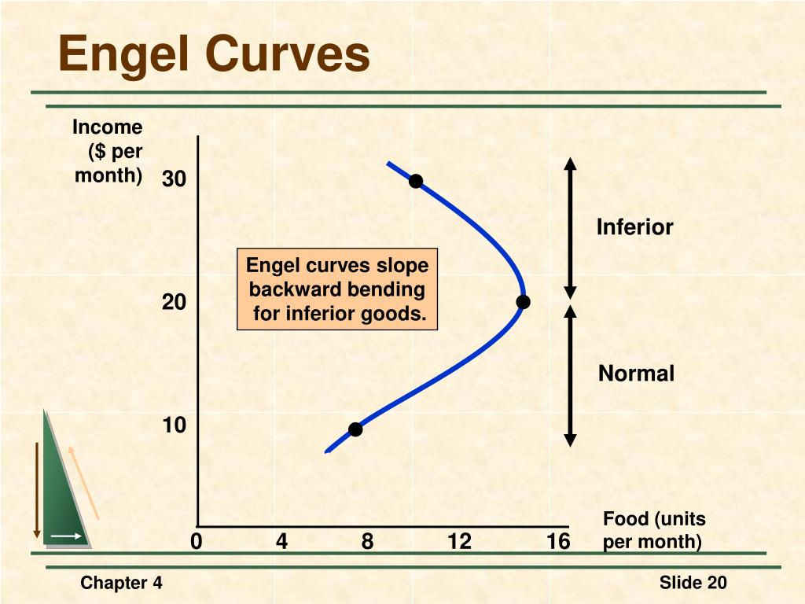
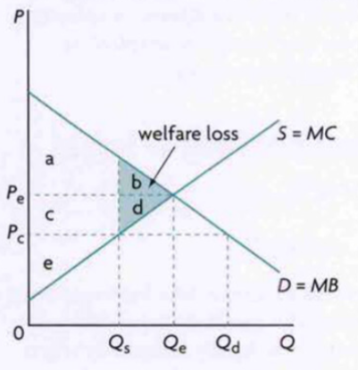
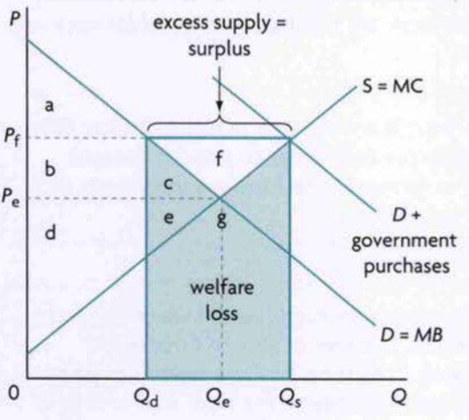
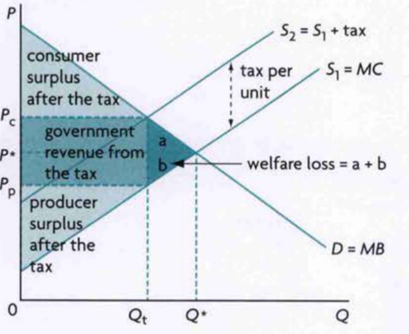
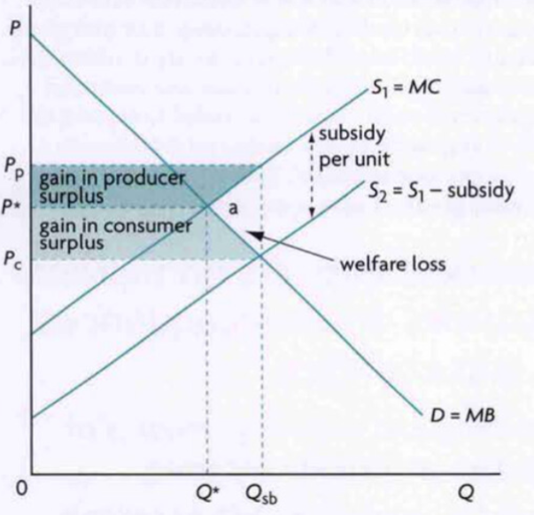
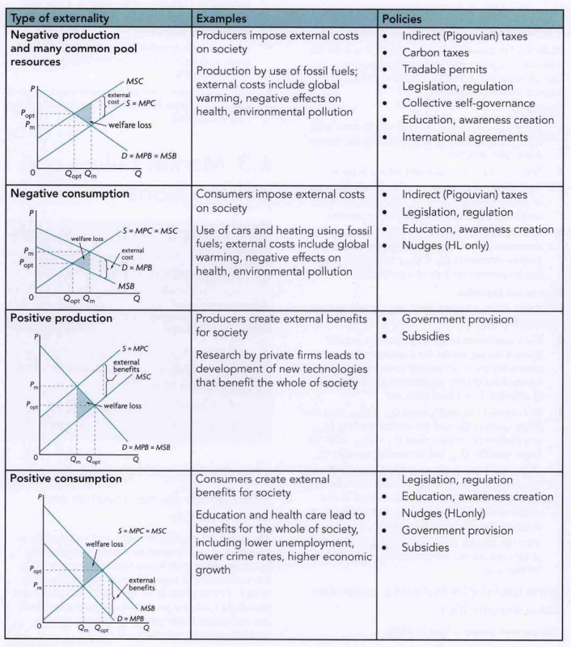

Unit 2: Microeconomics
=============

# 2.1: Demand

## The Law of Demand
As price of a good increases, the quantity demanded decreases. Demand is the willingness and ability to purchase something. 

### Assumptions
- **Income Effect:** *Larger prices means lesser purchasing power / real income therefore will want to buy less*
- **Substitution Effect:** *Larger prices force consumers to look for cheaper alternatives so demand for more expensive good falls*
- **Diminishing Marginal Utility:** *Marginal Utility (satisfaction per extra unit consumed) decreases with increased consumption, so consumer will only purchase more if it is at lesser price*

## Non-Price Determinants of Demand
These shift the demand curve instead of moving on it
| Determinant | Relationship | Notes |
| :---------- | :----------: | :---- |
|Income (Normal Goods)|$D \propto Y$|*Defined as a good for which demand increases when income increases*|
|Income (Inferior Goods)|$D \propto Y^{-1}$|*Defined as a good for which demand decreases when income increases. eg: second-hand goods or public transport*|
|Preferences and Tastes|Depends||
|Price of Substitute Goods|$D \propto P_S$||
|Price of Complementary Goods|$D \propto P_C^{-1}$||
|Number of Consumers|$D \propto N$|*Increase in number of consumers shifts demand right and vice versa*|

# 2.2: Supply
## Law of Supply
As price of a good increases, the quantity supplied decreases. Supply is the willingness and ability to sell something.

## Long-Run vs Short-Run
| Long Run                     | Short Run                 |
| ---------------------------: | :------------------------ |
| All Inputs/FOPs are variable | At least one FOP is fixed |

Note: Most assumptions are only taken/valid in the short-run.

### Assumptions
- **Diminishing Marginal Returns:** *Since one of the FOPs is limited, at one point there will be a maximum output:worker/marginal return ratio. Then, any additional worker will decrease the output*
- **Increasing Marginal Costs:** *Opposite to Marginal Returns as increasing marginal returns means diminishing marginal costs and then when it starts to fall MC increases*

## Non-Price Determinants of Supply
|Determinant|Relationship|Notes|
|:----------|:----------:|:----|
|Cost of Production|$S \propto C^{-1}$|Cost of Factors of Production|
|Technology|$S \propto T$||
|Competitive Supply|$S_X \propto P_Y^{-1}$|Due to opportunity cost, producer will choose to switch to more profitable good|
|Joint Supply|$S_X \propto P_Y$| eg: Higher petrol price means more petrol is sold. Since diesel also happens to be produced it also is sold more|
|Producer expectations|Depends|Firms might withhold or quickly sell products if they expect a certain price change|
|Indirect Taxes / Tax on Profit|$S \propto T^{-1}$||
|Subsidies|$S \propto subs$||
|Number of Firms|$S \propto N$||
|Supply Shocks|Depends||

# 2.3: Competitive Market Equilibrium
## Functions of the Price Mechanism
The price mechanism refers to the market forces of supply and demand changing the price of a good/service. 

- **Resource Allocation:** *Firms will only sell the products that consumers are willing and able to purchase*
- **Signalling:** *Price changes cause surplus/shortages that signal to producers whether to sell more or less*
- **Incentive:** *Producers/Consumers incentivised to act in their own self-interest according to the law of supply/demand*
- **Rationing:** *Divides who gets a good/service by price, since the poor are barred from purchasing it*

## Surplus
Social, Consumer, and Producer surplus are always maximised at competitive market equilibrium

## Allocative Efficiency
At MB = MC because S=MC and D=MB (think externalities diagram). Also this doesn't consider the inequalities in production (who to produce for) and only the resource allocation (what to produce)

**RWE: Uber dynamic pricing means at busy times prices increase. This is allocative efficiency because all drivers are used and all people searching for a ride get one. Huge inequality though as people who cannot afford the ride can't search for one (this also reduces wasteful competition at lower prices)**

# 2.4: Critique of Maximising Behaviour of Producers and Consumers
Huge assumption underlying the previous economic theory
- That consumers maximise utility/satisfaction
- That producers maximise their profits
- That workers maximise their wages
- That investors maximise their returns

## Rational Consumer Choice
That consumers always act rational. 

Assumptions:
- Consumers can always rank their preferences
- Their preferences are consistent
- They always prefer more of a good/service than less
- They always aim to maximise utility with limited budget
- Consumers have all required information before making a choice

|Assumption|Description|
|-|-|
|Completeness|Consumers can always rank their preferences|
|Transitivity|Their preferences are consistent|
|Non-Satiety|They always prefer more of a good/service than less|
|Utility Maximisation|Maximises Utility with Limited Budget|
|Perfect Information|Have all relevant information and no uncertainty|

## Behavioral Economics
Alternative to rational consumer theory (says that consumers are more complex). Proposes psychological, emotional, and social factors that influence decisions. 

- **Biases:** *Cognitive shortcuts that affect decisions. eg: Irrelevant Anchored Information, How Choices are Presented, Availability, Sunk-Cost*
- **Bounded Rationality:** *People can't process all available information due to cognitive, time, and complexity constraints*
- **Bounded Self-Control:** *People lack self-control and sometimes don't do what's best for themselves*
- **Bounded Selfishness:** *Sometimes people act altruistically, even at a personal cost*
- **Imperfect Information:** *Consumers lack time/resources/expertise to get all information. Firms also hide information*

### Choice Architecture
- **Default Choices:** *Choice made for consumers because they are too lazy to change it or don't want to hold responsibility of making the choice. eg: Automatic Enrollment into UK pension turned enrollment from 55% to 90%, Also 401k schemes in USA*
- **Restricted Choices:** *Limiting choices to nudge people in a direction. eg: soft-banning of single-use plastic goods in convenience stores doesn't force but nudges people to find sustainable alternatives*
- **Mandated Choices:** *Choice remains free but forced to make a choice to ensure participation and possibly encourage taking interest. eg: you need to answer an organ-donation question in Illinois when getting a driving license*

### Nudge Theory
How to influence choices without financial or legal methods. Non-coercive, subtle, and cost-effective as it is subconscious.

## Business Objectives
Other that profit-maximisation, firms could also aim for the following:

- **Corporate Social Responsibility:** *Benefitting society as a whole for improving brand image, long-term loyalty/profitability, employee satisfaction, reduces strict govt interference. eg: any company that "loves" the environment*
- **Market Share:** *Increasing this to get economics of scale and brand recognition. eg: e-commerce sites selling cheap products, corsair selling cheap RAM*
- **Satisficing:** *Achieving acceptable profit instead of maximum to balance stakeholder interests, employee satisfaction, work-life balance, time/information/resource constraints*
- **Growth:** *Similar to market share, but prioritises growth versus prioritising competitive market share. eg: product diversification of Amazon, Tata, etc.*

# 2.5: Elasticities of Demand
## Price Elasticity of Demand
Measure of the responsiveness of the quantity demanded of a good to changes in the good's price. Calculated by $\frac{|\%\Delta Q|}{\%\Delta P}$ (sort of inverse slope). Mathematically always negative but we take absolute to avoid confusion. 

Percentage change allows to compare b/w currencies and products. 

|Range|Classification|Revenue|
|:-:|-|:-:|
|$PED=0$|Perfectly Inelastic (no change in price can change demand)||
|$0<PED<1$|Inelastic (small change in demand)|$TR \propto P$|
|$PED=1$|Unit Elastic||
|$1<PED<\infty$|Elastic (large change in demand)|$TR \propto P^{-1}$|
|$PED=\infty$|Perfectly Elastic (any price you want). eg: In perfectly competitive markets where firms are price takers||

Since PED is calculated with percentages, it is elastic for high prices and inelastic for low prices on a straight-line demand curve. Intuitively understand this as being at a sort of breaking point at higher prices so more likely to quit. 

### Determinants of PED
|Determinant|Relationship|Notes|
|-|:-:|-|
|Substitutes|$PED \propto N \times C$|Number and Closeness|
|Necessity/Luxury|Depends|Necessities are inelastic, Luxuries are elastic|
|Length of Time|$PED \propto T$||
|Proportion of Income Spent|$PED \propto Y_P$||

### Taxes and PED
The lower the PED, the larger the government tax revenues (tax increases price, so if a good is inelastic many more people will still be there to pay taxes). $T \propto PED^{-1}$

### Primary and Manufactured Goods
Primary goods arise from the FOP of land (natural resources). Manufactured goods arise from labour working with capital and raw materials.

Primary goods generally have lesser substitutes than manufactured goods, thus are more inelastic. There are exceptions like medicines though. 

Results go the other way also however, so due to $\%\Delta Q < \%\Delta P$ in primary goods, small changes in quantity result in huge fluctuations in price, so primary good prices are generally more volatile. 

## Income Elasticity of Demand
Measure of the responsiveness of the quantity demanded of a good to changes in consumer income. Calculated by $\frac{|\%\Delta Q|}{\%\Delta Y}$

|Range|Classification|
|:-:|-|
|$YED<0$|Inferior Good|
|$0<YED<1$|Normal Necessity|
|$1<YED$|Normal Luxury|

### Engel Curve
YED changes with income and can be shown with the Engel Curve

### Applications of YED
Cycles in the economy change the proportions of different sectors (primary goods, manufactured goods, and services sectors) depending on recession or growth due to change in income and varying YEDs. 

Economic growth will decrease the size of primary sector and increase that of manufactured and services sectors (services are considered as luxuries). 

# 2.6: Elasticity of Supply
Measure of the responsiveness of the quantity supplied of a good to changes in its price. Calculated by $\frac{|\%\Delta S|}{\%\Delta Y}$

## Determinants of PES
- **Length of Time:** *How long firms have to change their inputs in response to price changes. eg: Small fishing boat can't bring more fish at a whim so inelastic but in the long-run can improve his capabilities so becomes elastic*
- **Mobility of FOPs:** *If *

|Determinant|Relationship|Notes|
|-|:-:|-|
|Length of Time|$PES \propto T$|eg: In short-run fishing boat can't bring more fish at whim but in the long-run he can upgrade|
|Mobility of FOPs|$PES \propto M_{obility}$|How easily resources can be switched from producing one good to another|
|Unused Capacity|$PES \propto C_{apacity}$||
|Ability to Store|$PES \propto A_{tostore}$||
|Rate of Cost Increase|$PES \propto R^{-1}$|Difficulty to expand if costs increase too rapidly|

## Primary and Manufactured Goods
Primary good FOPs are less mobile and take longer to react (eg: cycles of growth for farming, costs for oil), therefore have lower PES than manufactured goods. 

This means, like PED, price fluctuations are more common for primary goods than manufactured goods. 

# 2.7: Role of Government in Microeconomics

## Why do Governments Intervene?
- Government Revenue
- Provide support to Firms
- Provide support to low-income households
- Influence the Levels of Production of Firms
- Incluence the Levels of Consumption
- Correct Market Failure
- Promote Equity and Equality

## Forms of Government Intervention
### Price Ceilings
Maximum price below equilibrium to support consumers

- Causes a shortage
- Causes non-price rationing (first-come-first-served, favoritism in selling, etc.)
- Could lead to black markets due to shortage (like scalping)
- Examples include rent and food controls

### Price Floors
Minimum price above equilibrium to support producers/workers

- Causes a surplus
- Without government buying the surplus, market will shift back to equilibrium
  - Difficult for government to sell surplus
- Lower world price if government exports surplus
- Examples include minimum wages

### Indirect Taxes
Specific Taxes are a fixed amount of tax per unit sold (like $5 per box). Ad Valorem Taxes are a fixed percentage of the good price that is taxed (like 5% of the box price). 

All stakeholders except governments lose from taxes due to decreased production and increased prices. Governments gain revenue. 

### Subsidies
Any government assistance for individuals or groups of individuals, such as direct cash payments, low-interest loans, tax relief, etc.

- Subsidies increase producer revenue
- They make certain goods more affordable
- They encourage production
- They support growth
- They encourage exports of a certain good
- They can correct positive externalities

Everyone except governments benefit from subsidies as governments face subsidy costs.

Interesting case study is how farming subsidies are only given to the richest farmers and not small farmers in the USA. 

### Direct Provision of Services

### Command and Control Regulation and Legislation

### Consumer Nudges

# 2.8: Market Failure - Externalities and Common Pool or Common Access Resources

## Common Pool Resources
Rivalrous but non-excludable resources. Rivalrous means they are limited and something used by X can't be used by Y. Non-excludable means you can't stop someone from using it, so huge potential for overuse and exploitation. 

Private goods are rivalrous as well but are excludable. 

### Tragedy of the Commons
Since the use of a common resource is shared and non-excludable, but at a fixed price for all, it is rational for individuals to overuse it. 

## Market Failure
Failure of the market to achieve allocative efficiency.

Externalities arise when the interactions between a producer and consumer give rise to positive or negative consequences for a third party whose interests are not taken into consideration. It is a diverging of private and social costs or benefits.

Merit goods are desirable for consumers, while demerit goods are not desirable for consumers.

### Policies for Negative Production Externalities
All to shift MPC upwards
- **Indirect (Pigouvian Taxes):** *To discourage production*
- **Carbon Taxes:** *Upward shift of MPC. eg: Denmark, Finland*
- **Tradable Permits:** *Similar to Carbon Taxes. Draw perfectly inelastic supply of permit market. eg: Kazakhstan, Switzerland*
- **Legislation and Regulation:** *Commanding the economy with laws. eg: requiring factories to include carbon filters or banning the use of harmful substances in production*
- **Collective Self-Governance:** *Common agreement to sustainably use common-pool resources. Happens naturally but could fail if there is no communication between producers*
- **Education and Awareness:** *Firms are influenced by their market opinion so might want to drop unsustainable practices to get sales, but could fail if the externality is on a large scale*
- **International Agreements:** *Cooperation between governments of different nations to create legislature*

#### Specific Example: Reducing Carbon Emissions
Disadvantages are that it such taxes are regressive, and also that it is difficult to define social cost so you can't exactly decide on a good tax amount. Tradeable permits might fall to corruption or under-reporting of emissions. 

|Carbon Tax Benefits|Tradable Permit Benefits|
|-|-|
|Makes energy prices more predictable due to price of permits||
|Easier to design and implement||
|Can be blanket-applied to all users of fossil fuels (producers and consumers)||
|No opportunities for manipulation by corruption||
|Less monitoring for enforcement as it only depends on how much fuel was purchased||
|Governments might want to set permit limits too high||
||Governments might want to set taxes too low|
||Can focus on the specific type of pollution|
||Carbon taxes are regressive and affect lower income consumers more|

### Policies for Negative Consumption Externalities
Indirect taxes are very commonly used. Problems include the difficulty in calculating external costs to set a proper tax and the fact that some demerit goods like oil are inelastic. 

Nudges are also a good solution, although there is an issue of certainty of its effects across cultural or economic groups. 

### Policies for Positive Production Externalities
To shift MPC rightwards
- **Direct Government Provision:** *Government investing in R&D or directly training workers*
- **Subsidies:** *To promote production*

### Policies for Positive Consumption Externalities
To shift MPB rightwards
- **Government Legislature:** *eg: Education being compulsory*
- **Education and Awareness:** *To promote consumption*
- **Nudges:** *To subconsciously promote consumption*
- **Direct Government Provision:** *eg: Provision of education and healthcare. Uniquely shifts supply rightwards to increase merit good consumption*
- **Subsidies:** *Also uniquely shifts supply rightwards*

# 2.9: Market Failure - Public Goods

## Public Goods
They are non-rivalrous and non-excludable. Examples include public parks, air, national defense, infrastructure. 

Free riders are individuals who use a public good without contributing to its cost. For example people who don't pay taxes. 

## Government Intervention
- **Direct Government Provision**
  - Difficulties
    - Deciding which good should be provided and in what quantities
    - Estimating benefits of giving a good
- **Contracting out to Private Sector**
  - Advantages
    - Private sector might have more skills than the govt
    - Private sector has more innovation and flexibility
    - Lower prices emerge due to competition (all companies want to contract with govt)
  - Difficulties
    - Government loses accountability and control
    - A risk that the quality of the good decreases
    - Would probably cost more to the govt
    - Needs strict govt monitoring as well

# 2.10: Market Failure - Asymmetric Information
Asymmetric information is when buyers and sellers do not have equal access to information. 

## Adverse Selection
When one party has more information about the quality of a product than the other. 

### When sellers know more than buyers
eg: Unsafe medicines being sold, bad quality items being sold, etc.

This results in overallocation of resources to this good/service. 

Also possible for supplier-induced demand. Eg: a doctor selectively revealing information that causes the patient to want more tests or treatments to be done. This would not exist if the patient had equal access to information.

Govt. Responses
- **Regulation:** *Passing laws to standardise quality. Difficulty in enforcing due to time and cost*
- **Provision of Information:** *Directly providing information to consumers or forcing producers to do so. Example in Europe many countries provide fee schedules to ensure quality. However, might not be able to trust the govt, and will never be 100% effective*
- **Licensure:** *Mandating a basic license if you want to be a supplier, such as doctors or teachers*

Private Responses
- **Screening:** *Initiative taken by the consumer to get more information about their purchase from the internet or other sources*
- **Signalling:** *Building trust with consumer by showing signs of trustworthiness. Examples include giving warranties, making service records available, or subconscious methods as well. One issue is it might just be manipulation or misleading information*

### When buyers know more than sellers
eg: Medical insurance. Once again causes the underallocation of resources as sellers reduce risks. 

Note: A deductible is how much of the cost you have to bear yourself, and the rest is taken care of by insurance

Govt. Responses
- **Provision of Services:** *The government could provide the service in question in equal amounts to everyone* 

Private Responses
- **Screening:** *Initiative taken by the producer to get more information about the buyers, such as insurance providers assuming that those who choose higher-cost policies with low deductibles are in critical condition. This can be flawed due to other biases (like how low-income people will only be able to afford low-cost policies)*

## Moral Hazard
When a party takes a risk but does not face the consequences of their risks (they are transferred to another party)

Generally arises when a buyer of insurance changes their behaviour (becomes more relaxed) after purchasing insurance, working against the seller of insurance.

Many believe the 2008 recession / financial crisis was caused by moral hazard. Big banks took insane risks thinking that the government would support them if they fell (and they did). 

One solution is insurance companies have deductibles for the purchaser to still pay so there is still a risk for them. 

In the financial sector this is with government regulation. 

# 2.11: Market Failure - Market Power

# 2.12: The Market's Inability to Achieve Equity
Inequality persists due to
- Price and Ownership of FOPs, and skills is highly unequal

Inequality is not a market failure, as market failure is defined as inability to achieve allocative efficiency or reduced social surplus.