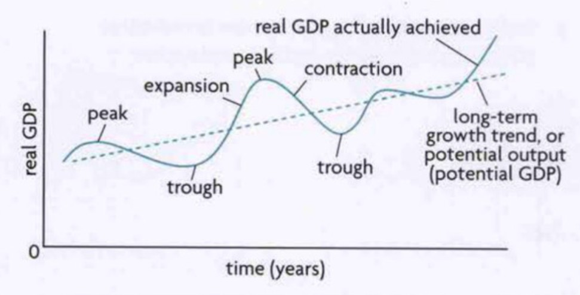
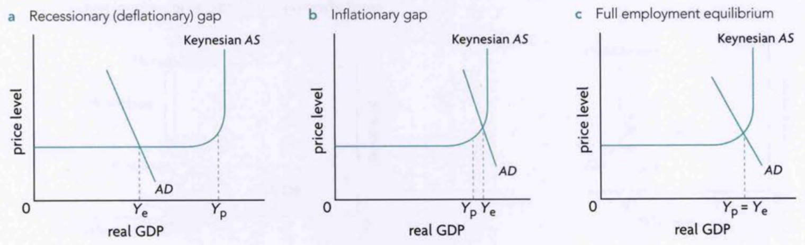
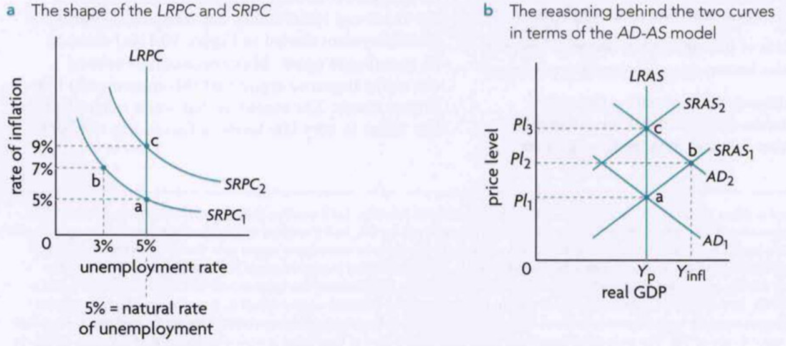

Unit 3: Macroeconomics
========

# 3.1: Measuring Economic Activity and Illustrating its Variations

## Methods of Calculating National Income
Ideally all three methods give the same result after slight adjustments. 

### Expenditure Approach
$GDP = C + I + G + (X-M)$

Summing the total consumer spending on final goods and services (not including housing that is investment), all investment spending on capital or construction, all government spending on FOPs or infrastructure, and net exports / imports. 

### Income Approach
Summing the total income earned by FOPs (wages by labour, rent by land, interest by capital, profits by entrepreneurship). This is not exactly GDP. 

### Output Approach
Sums the value of each final good and service produced.

## GDP vs GNI
GDP is the final value of all goods and services produced within the domestic boundaries of a country in one year. 

GNI accounts for remittances and multinational corporations, so it is the final value of all goods and services for one nation in one year. 

$GNI = GDP + \text{net income from abroad}$

## Real vs Nominal
Nominal GDP and GNI values only take into consideration the current value of goods and services. Real GDP and GNI take inflation into consideration to eliminate the influence of changing prices themselves and only focus on the changing economic activity.

$\text{Deflator} = 100 \times \frac{\text{Nominal GDP}}{\text{Real GDP}}$

## Total vs Per Capita
Per capita values account for the differing populations in different countries and accounts for population growth over time

$\text{GDP or GNI per capita} = \frac{\text{GDP or GNI}}{\text{Population}}$

## Purchasing Power Parity
The amount of a country's currency that is needed to buy the same amount of local goods and services as 1 USD in the USA. PPP rates are calculated regularly. They allow for comparison of GDP/GNI per capita while accounting for the differing price levels of the same goods in different countries. For example, a laptop that costs $400 in the USA costs $600 in India due to tariffs and whatnot. 

## The Business Cycle

Line shows economy at full employment (natural rate of unemployment), thus showing the potential output over time. When the economy is below this line there is a recessionary output gap (underproduction and high unemployment) and when it is above there is an inflationary gap (overproduction, "overheating", and low unemployment)

We study this cycle to find ways to reduce the fluctuations of the cycle, achieve price stability, achieve full employment, and achieving more rapid economic growth (increase steepness of the straight line)

## Disadvantages of GDP/GNI Measures
GDP/GNI can't measure output that well actually
- Don't count non-marketed output. Examples include someone repairing their own house or eating some of the crop they grew
- Don't include black markets / underground markets / unreported transactions
- Don't take into account the improving quality of goods and services
- Don't include the costs of negative externalities
- Don't consider the depletion of natural resources
- Might produce inaccurate comparisons if you do not account for PPP

GDP/GNI can't measure economic well-being that well either
- No difference between output of demerit or merit goods
- Don't reflect improvements in standard of living, education, health, or life expectancy
- Don't depict the inequality in income or wealth
- Don't take into account leisure increases in developed countries

### Alternative Measures of Well-Being
- **OECD Better Life Index:** *Takes many factors into account, both short-run (health, work-life balance, environmental quality, and material conditions like housing and income) and long-run (natural, human, economic, and social capital). However fails to account for equity in the country*
- **Happiness Index:** *By the UN. Accounts for RGDP/capita, social support, healthy life expectancy, freedom of choice, generosity, perceptions of corruption. Doubt arises because it is difficult to quantify happiness between cultures and doubt on the sources of information the UN uses*
- **Happy Planet Index:** $Index = \frac{\text{life expectancy} \times \text{well-being} \times \text{inequality of outcomes}}{\text{ecological footprint}}$ *Mainly focusses on happiness of the planet, but criticised for its measure of well-being and the ecological footprint is a controversial concept*

# 3.2: Variations in Economic Activity - Aggregate Demand and Aggregate Supply

## Aggregate Demand
Total quantity of output that all buyers in an economy want to buy at different possible price levels

### Determinants of AD shifts
| Determinant                          |        Relationship         | Notes                                                |
| ------------------------------------ | :-------------------------: | ---------------------------------------------------- |
| Consumer / Business Confidence       | $AD \propto C_{onfidence}$  |                                                      |
| Interest Rates                       | $AD \propto R_{ates}^{-1}$  |                                                      |
| Wealth                               |       $AD \propto W$        | The value of assets that someone owns                |
| Income / Business Tax                |  $AD \propto T_{ax}^{-1}$   | Reduces consumer's **Disposable Income**             |
| Household / Corporate Indebtedness   |  $AD \propto D_{ebt}^{-1}$  |                                                      |
| Future Price Expectations            | $AD \propto E_{xpectation}$ |                                                      |
| Technology                           |    $AD \propto T_{ech}$     | Stimulates Investment Spending                       |
| Legal / Institutional Changes        |           Depends           |                                                      |
| Govt Political / Economic Priorities |           Depends           |                                                      |
| National Income                      |  $AD \propto Y_{national}$  | Changes X-M                                          |
| Exchange Rates                       | $AD \propto P_{rice}^{-1} $ | If price of currency increases in USD, X-M decreases |
| Trade Policies / Protection          |           Depends           |                                                      |

## Short-Run Aggregate Supply
Generally, the FOP that is the most rigid in the short-run is wages due to fixed labour contracts, minimum wage legislation, worker / labour unions

Aggregate supply is the total quantity of goods / services produced in an economy at different price levels. SRAS is the same but when resource prices (mainly wages) don't change

### Determinants of SRAS
| Determinant           |         Relationship          | Notes                                    |
| --------------------- | :---------------------------: | ---------------------------------------- |
| Resource / FOP prices | $SRAS \propto P_{rices}^{-1}$ | Wages / Rent / Other costs of production |
| Subsidies             |    $SRAS \propto S_{ubs}$     |                                          |
| Indirect Taxes        |  $SRAS \propto T_{ax}^{-1}$   |                                          |
| Supply Shocks         |            Depends            |                                          |

## Long-Run Aggregate Supply
The output at full employment / natural rate of unemployment. It is vertical because in the long-run, with resource prices flexible, the cost of production stays the same no matter the price level. If the prices of goods increases in the short-run, soon the suppliers of the FOPs will demand higher prices and so cost of production increases. 

- **Deflationary / Recessionary Gaps:**
  - When equilibrium output ($Y_e$) lies to the left of potential output ($Y_p$), or such that $Y_e < Y_p$
  - Not enough demand in the country, so firms require less labour and thus unemployment is higher than natural

- **Inflationary Gaps:**
  - When $Y_e > Y_p$
  - Too much demand in the country, so firms require more labour and thus unemployment is lower than natural

- **No Gaps:**
  - When $Y_e = Y_p$
  - Full employment / natural rate of unemployment

### Effect of Gaps in the Short-Run
AD shifting right causes expansion phase and inflationary gap, shifting left causes contraction phase and deflationary gap

SRAS can also contribute to price fluctuations. Same behaviour (right and left) as AD

### In the Long-Run
According to Monetarist / Neo-Classical perspective, the only effect of changes in AD in the long-run is changing the price level as the costs of production will always react in the long-run and shift the SRAS until the output is back at potential

## Keynesian Model of Supply
Keynesian economists argue that in extreme cases of recessionary gaps, wages and product prices are not as flexible as they are in inflationary gaps. They argue that there is also a maximum output after which prices increase rapidly

$Y_p$ slightly to left of $Y_{max}$

## Shifts of LRAS
| Determinant                  |         Relationship          | Notes |
| ---------------------------- | :---------------------------: | ----- |
| Quantity / Quality of FOPs   |       $LRAS \propto Q$        |       |
| Technology                   |    $LRAS \propto T_{ech}$     |       |
| Efficiency                   | $LRAS \propto e_{fficiency} $ |       |
| Institutional Changes        |            Depends            |       |
| Natural Rate of Unemployment |  $LRAS \propto R_{ate}^{-1}$  |       |

## Keynesian vs Monetarist Views
|                                            Neo-Classical / Monetarist | Keynesian                                                                     |
| --------------------------------------------------------------------: | :---------------------------------------------------------------------------- |
| The economy will always self-correct and achieve long-run equilibrium | There are certain scenarios where the economy stagnates in a deflationary gap |
|                       Therefore markets should be as free as possible | Therefore Government Intervention is necessary                                |
|                             Increases in AD always raise price levels | Increases in AD doesn't affect price in a deflationary gap                    |
|    Therefore should focus on LRAS policies not AD policies for growth | Therefore AD policies are harmless and necessary to correct gaps              |

# 3.3: Macroeconomic Objectives

## Low Unemployment
Unemployment rate is percentage of labour force (people of working age) that are actively looking for a job but not employed at the moment. This leads to a wastage of resources

### Drawbacks of Unemployment Rate Figures
Possible underestimation due to *hidden unemployment*:
- **Discouraged workers:** *Those who have given up looking for jobs due to not getting a job*
- **Part-Time Employees:** *Included in the employed numbers but most still want / are searching for a full-time job*
- **Underemployment:** *Does not distinguish between part-time and full-time. Does not account for if the skill level and job match (eg: waiter with a PhD)*
- **Training Programmes:** *People who are on re-training programmes due to losing their job*
- **Early Forced Retirement:** *Those who retire early but would rather be working*

Possible overestimation
- **Underground Economy:** *People working here are not counted as employed*

Also aggregate unemployment figures don't consider differences in unemployment rates within regions, genders, ethnic groups, age, occupational / educational attainment

### Costs of Unemployment
- **Economic Costs:**
  - Loss of output (RGDP)
  - Loss of income for the unemployed
  - Loss of tax revenue for the govt AND Govt has to pay unemployment benefits so larger budget deficit
  - Govt has to solve the social problems of unemployment
  - Unequal distribution of income
  - The unemployed become discouraged and fall into hysteresis in the long-run
- **Personal and Social Costs:**
  - No income means larger indebtedness, loss of self-esteem, larger stress, mental and physical health issues, suicide
  - High rates of unemployment could lead to higher levels of crime, violence, drug and alcohol abuse, homelessness, and poverty

### Causes of unemployment
Natural rate of unemployment is simply the sum of structural, frictional, and seasonal unemployment

- **Structural Unemployment**
  - *Changes in demand for a type of skill (Labour Demand shifts)*
  - *Changes in geographical location of industries (Labour Demand shifts)*
  - *Labour market rigidities*
    - Minimum Wages are price floors or increased COP
    - Labour Unions cause price floors or increased COP
    - Employment Protection Laws (You can't fire without a notice) caused increased COP as companies hire carefully
    - Unemployment Benefits cause decreased supply of labour
  - Note: Structural Unemployment tends to be long-term
- **Frictional Unemployment**
  - *When workers are moving between jobs (got fired, searching for a better / new job)*
  - Note: Generally short-term and not too serious. Reduced by reducing the between job time and improving information flow between workers and employers
- **Seasonal Unemployment**
  - *Unemployment due to seasonal production of a good / service*
  - Note: Unavoidable type of unemployment
- **Cyclical Unemployment**
  - *Demand-deficit unemployment during the downturns / contractions of the business cycle, in a deflationary gap*

## Low and Stable Rate of Inflation
Economies want low rates of inflation and not zero because that is too close to deflation

Inflation is any sustained increased in price level (increase to a level and not fall down). Disinflation is a decrease in the rate of inflation (like 3% in 2021 to 2.5% in 2022)

Deflation is a sustained decrease in price level

Inflation is bad because
- **Redistributive Effects**
  - *People who lose money: those who receive fixed wages or wages that don't rise as fast as inflation, savers with interest rates below inflation rate, and lenders*
  - *People who gain money: those who borrow, those who pay fixed wages or wages that don't rise as fast as inflation*
- **Uncertainty**
  - *Can't predict future changes in purchasing power, so uncertainty in economic decisions by firms so less investment and growth*
- **Lower Incentives to Save**
- **Lower Export Competitiveness**
- **Reduces Economic Growth**
- **Allocative Inefficiency**
  - *Rapidly rising prices distort the signalling and incentive functions in the market, decreasing allocative efficiency*
- **Unequally Distributed Social and Personal Costs**

Hyperinflation is inflation at a rate of >50% per month. Some examples include Germany after WWI, Venezuela in 2018, Zimbabwe over 11M% in 2008

### Measuring Inflation
This is done with price indices, either CPI or GDP Deflator

**Consumer Price Index (CPI):** *Value of an average basket of goods in each year. $CPI = 100 \times \frac{\text{basket price in year n}}{\text{basket price in base year}}$, Inflation is calculated as the percentage change in CPI*
- **Problems with CPI**
  - *Different rates of inflation for different income earners / cultures / regions due to different baskets*
  - *Doesn't account for consumption changes in case of price changes*
  - *Doesn't account for consumers buying more often at discount stores*
  - *Doesn't account for new products being introduced*
  - *CPI baskets are revised every 10 years so no long-term comparability*

### Demand-Pull Inflation
When AD shifts right from an initial position at full employment, the new equilibrium in an inflationary gap causes inflation and high employment

### Cost-Push Inflation
When SRAS shifts left from an initial position at full employment, the new equilibrium causes inflation and low employment. This is also known as stagflation

Note: Output gaps are ONLY caused by too much or too little AD. SRAS shifts do not cause output gaps

### Deflation
Deflation is rare as wages generally don't fall, and large oligopolistic sellers fear price undercutting wars. 

Costs of deflation include
- **Redistributive Effects**
  - *Opposite effects of that in inflation*
- **Increase in Real Value of Debt**
  - *This increases the risk of bankruptcies and a financial crisis*
- **Same level of uncertainty**
- **Deferred Consumption**
  - *Consumers postponing their spending because they expect prices to continue falling*
- **Same ineffectiveness of signalling and incentives so causes resource misallocation**
- **Policy Ineffectiveness**
  - *Especially Monetary Policies*

### Unemployment and Inflation
Difficult to achieve low inflation and low unemployment at the same time

Phillips curve shows that there is a short-run negative relationship between inflation and unemployment, but in the long-run the curve is vertical at the natural rate of unemployment. 

Shifts of AD cause movements on the SRPC, while shifts of SRAS cause opposite shifts of SRPC (SRAS going left means SRPC goes right). Example of short-run and long-run effects of expansionary demand-side policy below

## Economic Growth
Measure of economic growth is percentage change in RGDP

$\%\Delta RGDP/capita = \%\Delta RGDP - \%\Delta population$

Increasing AD or SRAS causes short-term economic growth, although AD is the more prominent factor. Shown by a movement of a point inside the PPC. Caused by increased employment and efficiency

Long-term economic growth is shown with a shift of the LRAS, shown by a shift of the PPC outwards. Caused by increased resource quantity or quality, technological or institutional changes, and improvements in efficiency

### Consequences of Economic Growth
Higher GDP per capita means higher potential for people to improve their standard of living. However it is important that the economic growth is equally distributed between classes and genders, that the government further invests in merit goods, and that NGOs contribute further for economic growth to be helpful. 

Too rapid economic growth can also have negative effects on the environment with overuse of resources. While governments are taking initiatives to decrease the impact of economic growth on the environment, there are still effects. However, economic growth can allow governments to access possible solutions, which are generally more expensive, so economic growth can allow more green growth as well. 

During economic growth, many things like market-based economic policies or lessening the government protection of vulnerable groups can increase inequality during growth. Many countries are seeing an unequal distribution of incomes and growth during economic growth. 

## Sustainable Levels of Government Debt
The money that the government owes to parties outside of the government itself. 

Government revenue is mostly from taxes. However most of the time governments spend more than they earn, and are in a budget deficit. Governments can also borrow money by issuing bonds. 

Debt to GDP ratio is a measure of the ratio of the government debt to its GDP in a percentage. 

### Costs of High Levels of Debt
- **Debt Servicing Costs:** *The money the government owes plus interest. If foreign loans are taken, govt is forced to use export earnings to pay this back*
- **Lower Credit Rating**
- **Impacts on Future Govt Spending and Taxation:** *Govts are forced to increase taxes or decrease spending to lower deficit and pay back debt. This could decrease GDP and also increase debt-to-GDP ratio. This leads to a recession which further increases the budget deficit. This happened to Greece*
- **Increased Income Inequality:** *High income people can buy bonds, so govts pay high income people with the taxes of low income people*
- **Lower Private Investment**
- **Debt Trap:** *Borrowing to pay back a loan and repeating this process is a debt trap. Greece and Latin American countries are examples of this*

# 3.4: Economics of Inequality and Poverty

## Lorenz Curve
Shows the relationship between the percentages of population and the percentage of income that they earn

The gini coefficient / index is a summary measure of the information contained in the Lorenz curve of a country. It is the ratio between the area between the Lorenz curve and the diagonal (line of perfect equality [LOPE]) and the total area under the diagonal. 0 means perfect equality, and 1 means perfect inequality. 

In most countries, the wealth gini is higher than the income gini. This is because they are in a positive feedback loop. Greater income allows for more ways to store wealth (bonds, stocks, etc.), and more ways to store wealth means greater income. 

Lorenz Curve shifting inwards (towards the LOPE) means income / wealth is being more equally distributed, while it shifting outwards means income / wealth is being more unequally distributed

## Poverty
The inability to satisfy minimum consumption needs
- **Absolute Poverty:** *Anyone living with an income under the poverty line. Different national poverty lines exist, but the World Bank has set the international line at $1.9 a day (changed every so often to take inflation into account)*
  - More accurate lines are actually $3.2/day for lower-middle-income countries and $5.5/day for higher-middle-income countries. Almost half the global population is under the latter
- **Relative Poverty:** *Those earning below 50% of the median income*

Research going on to find minimum acceptable living standards and measuring poverty based on those who live under these standards. 

There is also the Multidimensional Poverty Index (MPI) that takes many other factors into consideration such as child mortality, nutrition, years of schooling, school attendance, cooking fuel, drinking water, electricity, assets, etc.. It essentially thinks of poverty as more than a condition of income, and there are many areas where poor people experience deprivations. 

### Difficulties in Measuring Poverty
- Different meanings of poverty
- Measurement Problems
  - Income measures don't take into account savings and vice versa
  - If measured by surveys, the data collected might be subjective
  - Surveys generally find it hard to include homeless people, despite them being hit by poverty the hardest
  - Income figures can be understated in the case of freelancing or investment income
  - Urban areas have higher cost of living than rural areas, so poverty lines might not include the poor in urban areas
  - They only show how many people fall below the line, but not how poor they are
- Governments have an incentive to sometimes underestimate the poverty line (to spend less on poverty reduction) or overestimate it (to call for more foreign aid or multilateral assistance)

## Causes of Poverty and Inequality
- Inequality of Opportunity
- Differing Human Capital
- Differing Levels of Resource Ownership
- Discrimination
- Unequal Status and Power
- Tax Policies Preferring the Rich
- Replacement of Low-Skill Labour by Technology
- Globalisation Leading to Outsourcing of Certain Jobs
- Market Based Supply-Side Policies
- High Abnormal Policies of Firms with Market Power (Money flows from consumers to Producers)
- Increases in Pay of Certain Occupations
- Unemployment
- Geographical Difficulty to Work
- Age
- Poverty Cycle

## Impact of Inequality
- **Economic Growth:** *Greater inequality might slow down growth because the poor cannot re-invest in the market, the wealthy spend a smaller portion of their income, policies that only favour the rich might be implemented which go against the interests of the population, and less govt provision of merit goods*
- **Lower Living Standards**
- **Social and Political Instability:** *Higher inequality creates divided societies, where the richest gain more political power as well. Such political inequality might lead to unrest due to dissatisfaction*

## Taxation Policies
- **Direct Taxes:** *Taxes on personal income, corporate profits, or wealth (property or inheritance) directly. Some countries also have social security taxes that finance specific funds such as pensions or healthcare*
- **Indirect Taxes:** *Sales taxes, excise taxes (on specific products), or customs taxes (tariffs)*

### Types of Taxes based on % of Income Paid
- Flat / Proportional
- Progressive
- Regressive

Indirect taxes are regressive as the price of tax paid is the same but those with higher income pay a less fraction of their total income as a tax. Person earning $20000 and another earning $10000 will pay the same $3 tax on a new bag but their fraction of income paid differs

Some necessities are exempted from indirect taxes

## Policies to Reduce Inequality
- Taxes
- Investment in Human Capital
- Transfer Payments
- Targeted Govt Spending on Goods and Services
- Universal Basic Income 
- Policies to Reduce Discrimination
- Govt Intervention through Price Controls

# 3.5: Demand Management (Demand-Side Policies) - Monetary Policy